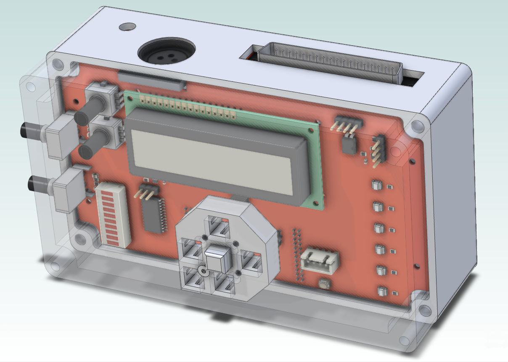
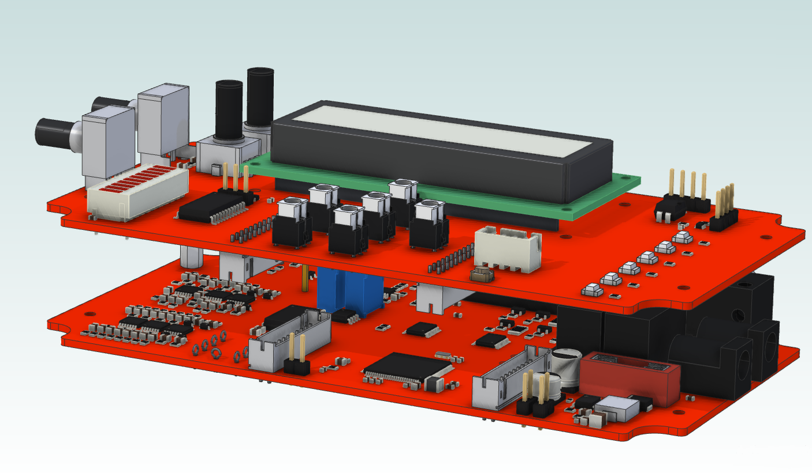

# LightDrum

### Have you ever wanted the drum set to be the loudest thing on stage? Well... this won't do that, but it will be extremely visible!

---

This is my dads christmas present. (From last year...) The idea is to lay strings of LEDs on his drum set and control the strings with audio and MIDI signals. The other purpose of this project is to learn. To that end, all interface libraries are written by me and are not feature complete or fully tested.

> Current Revision: REV6
>
> All revisions before REV4 are early prototypes and are for archival. They are not fully functional.

---

[Docs](./Docs/)

---

## Features

### Output
- 8 Individual LED String Channels
- 1 Amp per Channel rating

## Input
- 1/8" jack audio
- XLR Balanced audio
- MIDI DIN

## PWM channels

The 8 individual RGB channels are controlled with 3 [PCA9634.](https://www.nxp.com/docs/en/data-sheet/PCA9634.pdf) Providing 8-bit PWM steps per channel with overall brightness and multiplexing.

## Power Management

Each channel includes current monitoring with a high-side power override. This is all to avoid shorts and over-current conditions on the high current 12V supply.

## Audio Processing

8 channel band-pass filtering with peak-detection circuitry to perform a basic Fourier Transform.

The values used in the [BOM](./Docs/BOMs/REV6/LightDrum.csv) are the exact values needed. However, it would be prohibitively expensive if not impossible to find. The closest values I could find are detailed [here.](./Docs/BOMs/REV6/ActualFilterValues.ods)

## User Interface

- 16x2 LCD screen
- Directional Buttons for menu navigation
- Bar Graph for display of audio levels
- 6 LEDs for quick status indication
- 2 Programmable Rotary Encoders

## Firmware install

### Hardware Requirements

The project is built on the Arduino framework, using the ATMEGA 2560 (Arduino MEGA). Due to size constraints, adding a USB interface with all the necessary components would not be feasable. Instead, programming is done via the ICSP connector using an ATTiny USB programmer.

### Configuration

[env:megaUSB] : Uses the built-in programmer. This is only used for the older revisions. (REV1 & REV2)

[env:megaICSP] : Main programming method. Using the ATTiny USB programmer.