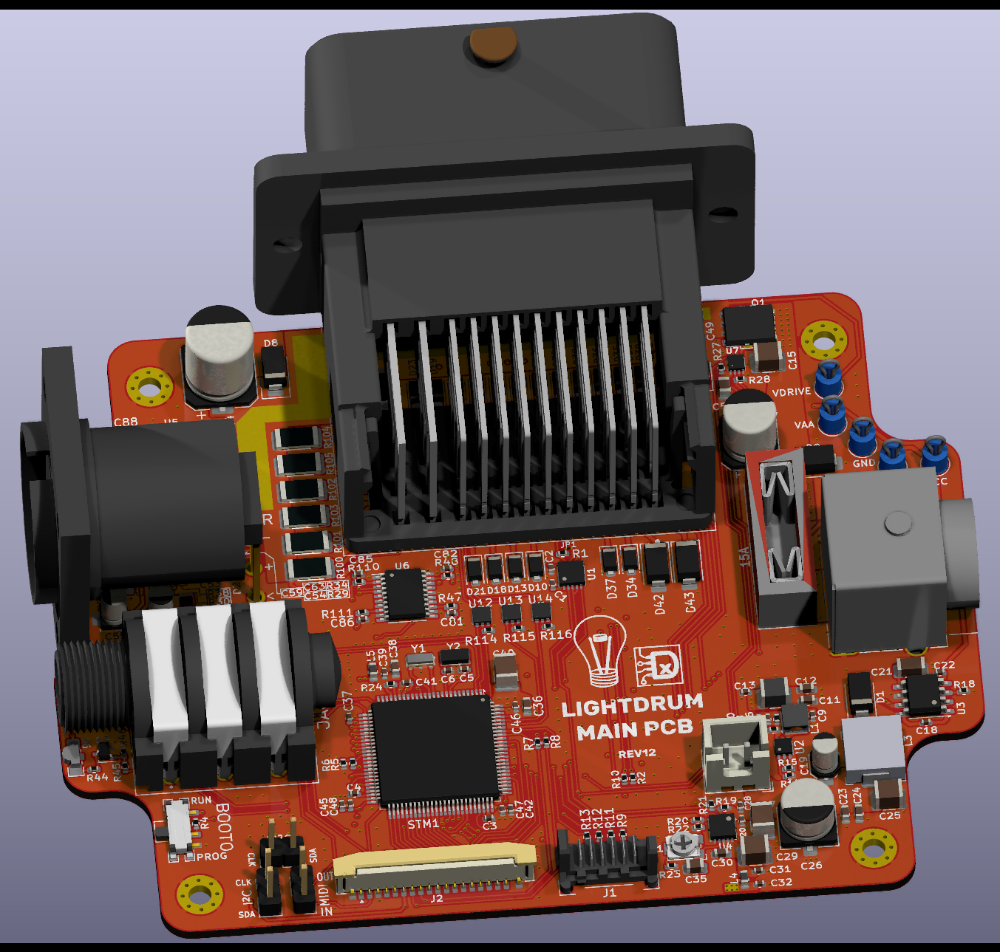
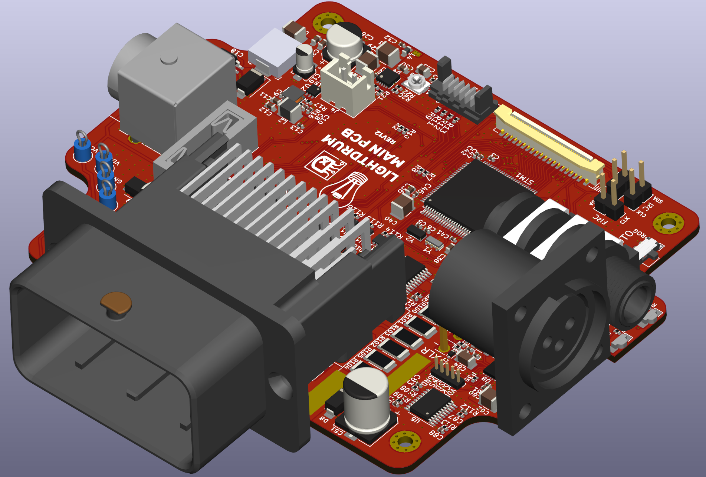
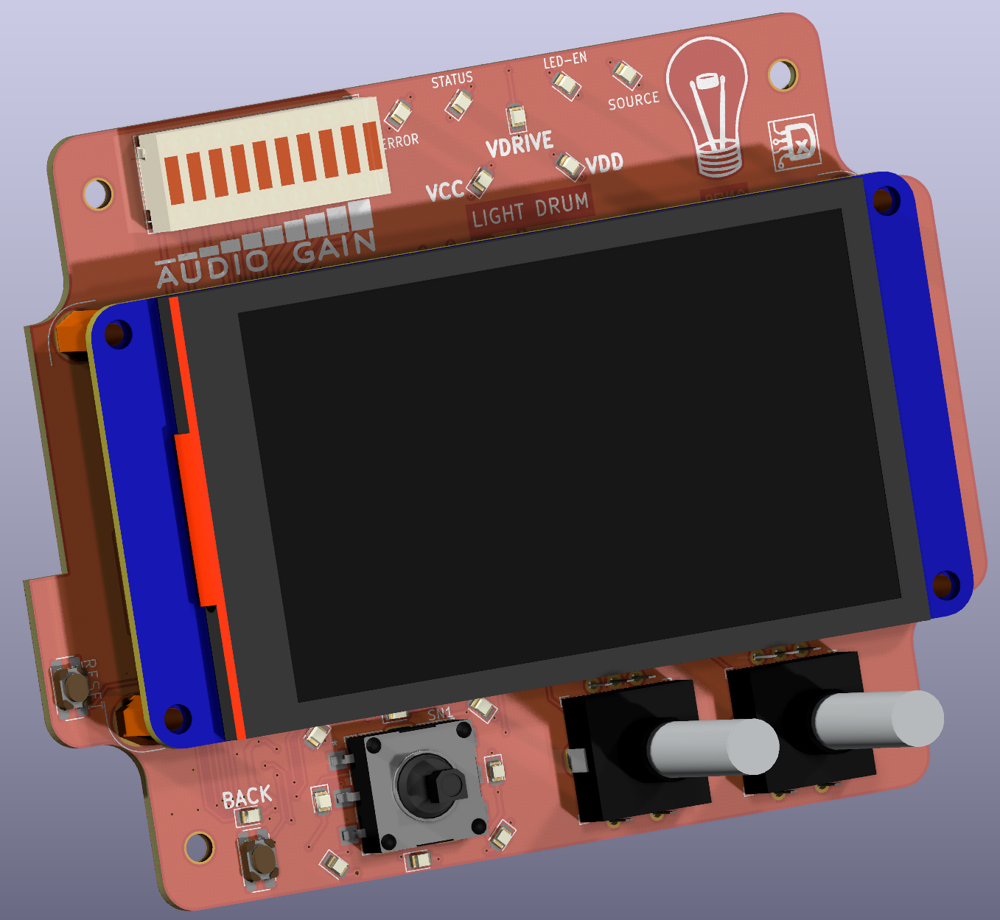

# LightDrum

### Have you ever wanted the drum set to be the loudest thing on stage? Well... this won't do that, but it will be extremely visible!

---

This is my dads christmas present. (I dont even remember how long it's been...) The idea is to lay strings of LEDs on his drum set and control the strings with audio and MIDI signals. With the ability to control more lighting systems through the DMX interface. The other purpose of this project is to learn. To that end, all interface libraries are written by me and are not feature complete or fully tested.

> Current Revision: `REV12`
>
> All revisions before REV8 are early prototypes and are for archival. They are not fully functional or feature complete.

# Renders

## Main PCB

## Interface PCB

## Features

### Output
- 8 Individual LED String Channels
- 1 Amp Rating per Channel
- DMX (RS-485) Interface

## Input
- 1/8" jack Audio
- XLR Balanced Audio
- MIDI
- DMX (RS-485) Interface

## PWM channels

The 8 individual RGB channels are controlled with 3 [PCA9634.](https://www.nxp.com/docs/en/data-sheet/PCA9634.pdf) Providing 8-bit PWM steps per channel with overall brightness and multiplexing.

## Bulk Lighting

The new automitive ECU connector has allowed for more pins, hense, some extra features. This includes 3 linear LED drivers for white COB LEDs. These are very bright and can either be controlled through the user interface, MIDI, or audio.

## Power Management

Each channel includes current monitoring with a high-side power override. This is all to avoid shorts and over-current conditions on the high current 12V supply. Both barrel jacks will need to be used for the LEDs to be activated. Due the large amount of power required, one barrel jack would probably melt.

## Audio Processing

The PCM1821 dual channel 32bit audio ADC handles the audio conversion and is sent to the MCU via I2S. Theres some minor filtering and impedance matching in the analog front-end. However, most of the audio processing will be handled in software.

## User Interface

- 3.2" TFT LCD Display
- Navigation Hat Switch for menu navigation
- Bar Graphs for display of audio levels and current load (or anything else I can think of.)
- 2 Contextual Rotary Encoders
- AND; a reset switch. For when things go horribly wrong.
- MicroSD card slot for loading lighting profiles and other options by the user.

The display contains a full menu to select modes, configure options, and IO. I'm using a Nextion display and their GUI editor for all the menuing. Its not the most performant display but it does allow for easy integration of a reasonably high res, full color screen.

In the future, Im planning to upgrade to a faster STM32 MCU, something like an F7, H5, or H7. Taking advantage of the TouchGFX GUI design software and integrate the screen control into the main MCU. Even with the faster MCU, it will be cheaper and increase screen performance, due to the removal of the Nextion display.

---

## Documentation

- [Docs](./Docs/)

- [Interactive BOMs](./Docs/BOMs/REV10/)

- TODO: Link to a user manual and theory of operation doc.

---

## Firmware installation

### Hardware Requirements

The old firmware was built with the Arduino Framework. The new MCU will be using the ST IDE, toolchain, and HAL (Hardware Abstraction Layer) along with the other required libraries. Im using the STLink programmer due to the much better performance and debugging than the ATTiny USB programmer.

### OLD PIO Configuration

[env:megaUSB] : Uses the built-in programmer. This is only used for the older revisions. (REV1 & REV2)

[env:megaICSP] : Main programming method. Using the ATTiny USB programmer.