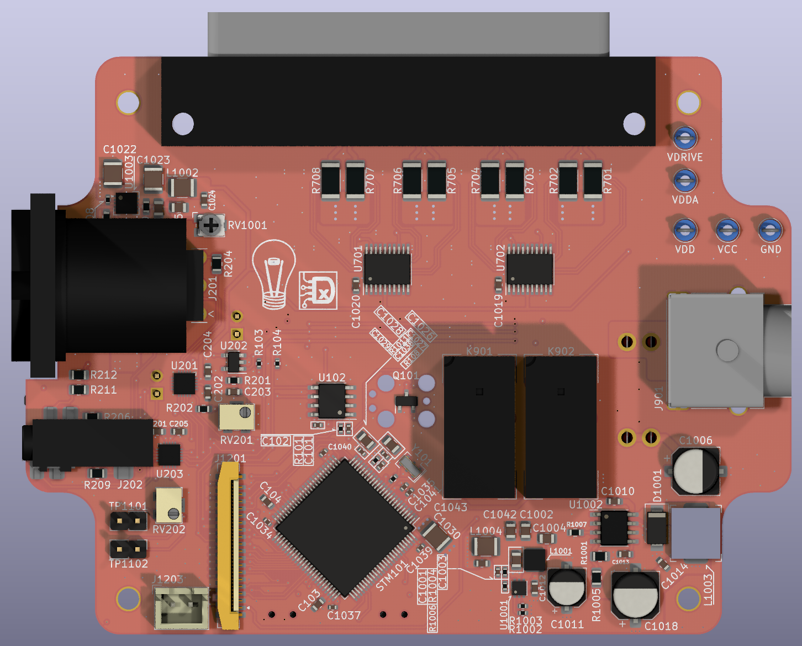
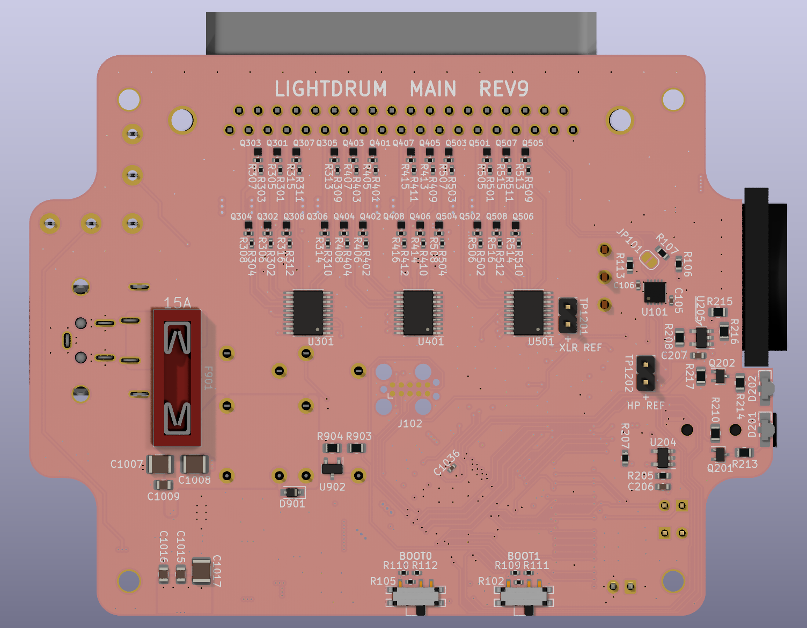
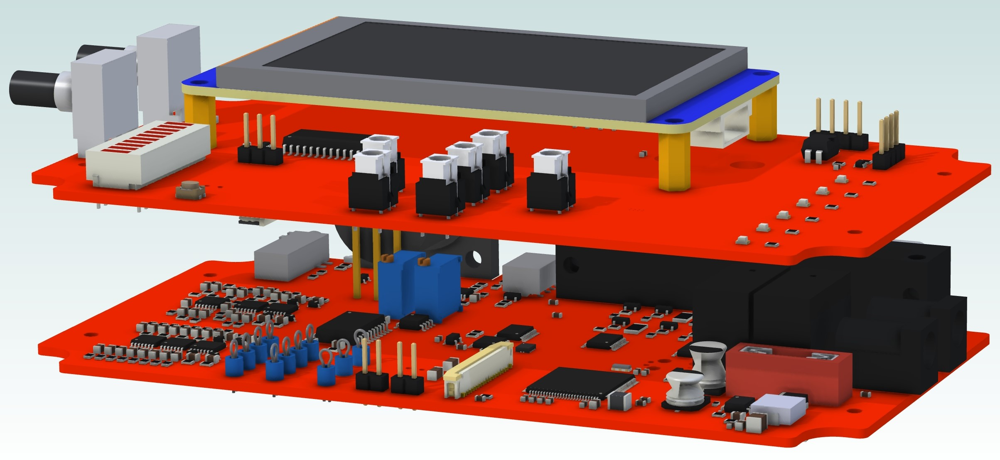
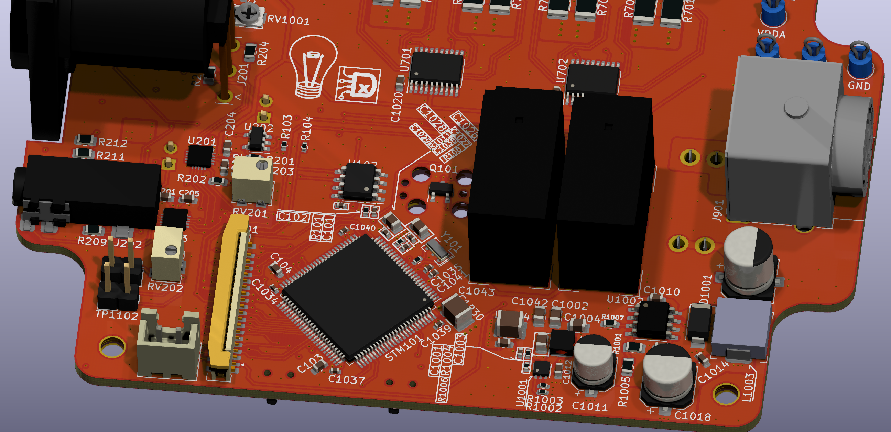

# LightDrum

### Have you ever wanted the drum set to be the loudest thing on stage? Well... this won't do that, but it will be extremely visible!

---

This is my dads christmas present. (From last year...) The idea is to lay strings of LEDs on his drum set and control the strings with audio and MIDI signals. The other purpose of this project is to learn. To that end, all interface libraries are written by me and are not feature complete or fully tested.

## Main PCB (WIP)

<!-- ## REV7 PCB Stack

 -->

> Current Revision: REV9
>
> All revisions before REV6 are early prototypes and are for archival. They are not fully functional.

---

[Docs](./Docs/)

---

# The "Fun" of routing out BGA packages

My brain hurt after this layout.

I want to use a BGA packaged STM32. Except the small size and the tolerance required makes the PCB manufacturing cost incredibly expensive. (Like $289 expensive.) I had to go with an STM32F412 in a TQFP100 package instead.

## Features

### Output
- 8 Individual LED String Channels
- 1 Amp Rating per Channel

## Input
- 1/8" jack Audio
- XLR Balanced Audio
- MIDI

## PWM channels

The 8 individual RGB channels are controlled with 3 [PCA9634.](https://www.nxp.com/docs/en/data-sheet/PCA9634.pdf) Providing 8-bit PWM steps per channel with overall brightness and multiplexing.

## Power Management

Each channel includes current monitoring with a high-side power override. This is all to avoid shorts and over-current conditions on the high current 12V supply. Both barrel jacks will need to be used for the LEDs to be activated. Due the large amount of power required, one barrel jack would probably melt.

## Audio Processing

A 12 bit ADC with a 200KHz sample rate will send the data to the STM32 for processing. That will be used to modify the triggers from the MIDI inputs and run processing techniques like beat detection and filtering.

## User Interface

- 3.2" TFT LCD Display
- Navigation Hat Switch for menu navigation
- Bar Graph for display of audio levels (or anything else I can think of.)
- 2 Programmable Rotary Encoders
- AAAAnd, a reset switch. For when things go horribly wrong.

The display will contain a full menu to select modes, configure options, and configure inputs and outputs. I'm using a Nextion display and their GUI editor for all menuing.

## Firmware installation

### Hardware Requirements

The old firmware was built with the Arduino Framework. The new MCU will be using the ST IDE, toolchain, and HAL (Hardware Abstraction Layer) along with the other required libraries. Im using the STLink programmer due to the much better performance and debugging than the ATTiny USB programmer.

### OLD PIO Configuration

[env:megaUSB] : Uses the built-in programmer. This is only used for the older revisions. (REV1 & REV2)

[env:megaICSP] : Main programming method. Using the ATTiny USB programmer.