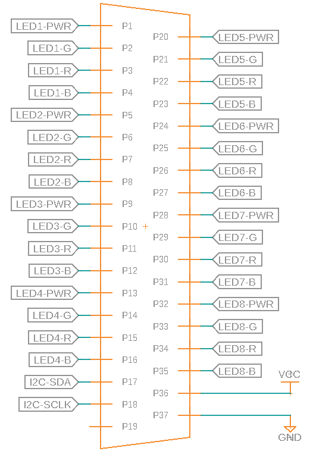

# LED Connector Pinout

Pinout for the main LED strip D-Sub connector.

> Pin Count : 37
> 
> Max Current: 1A

| # | Name | Description |
| --- | --- | --- |
| P1 | LED1-PWR | LED Strip Channel 1 +12V |
| P2 | LED1-G | Channel 1 Green |
| P3 | LED1-R | Channel 1 Red |
| P4 | LED1-B | Channel 1 Blue |
| P5 | LED2-PWR | LED Strip Channel 2 +12V |
| P6 | LED2-G | Channel 2 Green |
| P7 | LED2-R | Channel 2 Red |
| P8 | LED2-B | Channel 2 Blue |
| P9 | LED3-PWR | LED Strip Channel 3 +12V |
| P10 | LED3-G | Channel 3 Green |
| P11 | LED3-R | Channel 3 Red |
| P12 | LED3-B | Channel 3 Blue |
| P13 | LED4-PWR | LED Strip Channel 4 +12V |
| P14 | LED4-G | Channel 4 Green |
| P15 | LED4-R | Channel 4 Red |
| P16 | LED4-B | Channel 4 Blue |
| P17 | I2C-SDA | I2C Data |
| P18 | I2C-SCLK | I2C Clock |
| P19 | NC | Not Connected |
|
| P20 | LED5-PWR | LED Strip Channel 5 +12V |
| P21 | LED5-G | Channel 5 Green |
| P22 | LED5-R | Channel 5 Red |
| P23 | LED5-B | Channel 5 Blue |
| P24 | LED6-PWR | LED Strip Channel 6 +12V |
| P25 | LED6-G | Channel 6 Green |
| P26 | LED6-R | Channel 6 Red |
| P27 | LED6-B | Channel 6 Blue |
| P28 | LED7-PWR | LED Strip Channel 7 +12V |
| P29 | LED7-G | Channel 7 Green |
| P30 | LED7-R | Channel 7 Red |
| P31 | LED7-B | Channel 7 Blue |
| P32 | LED8-PWR | LED Strip Channel 8 +12V |
| P33 | LED8-G | Channel 8 Green |
| P34 | LED8-R | Channel 8 Red |
| P35 | LED8-B | Channel 8 Blue |
| P36 | VCC | VCC - +5V |
| P37 | GND | System Ground |